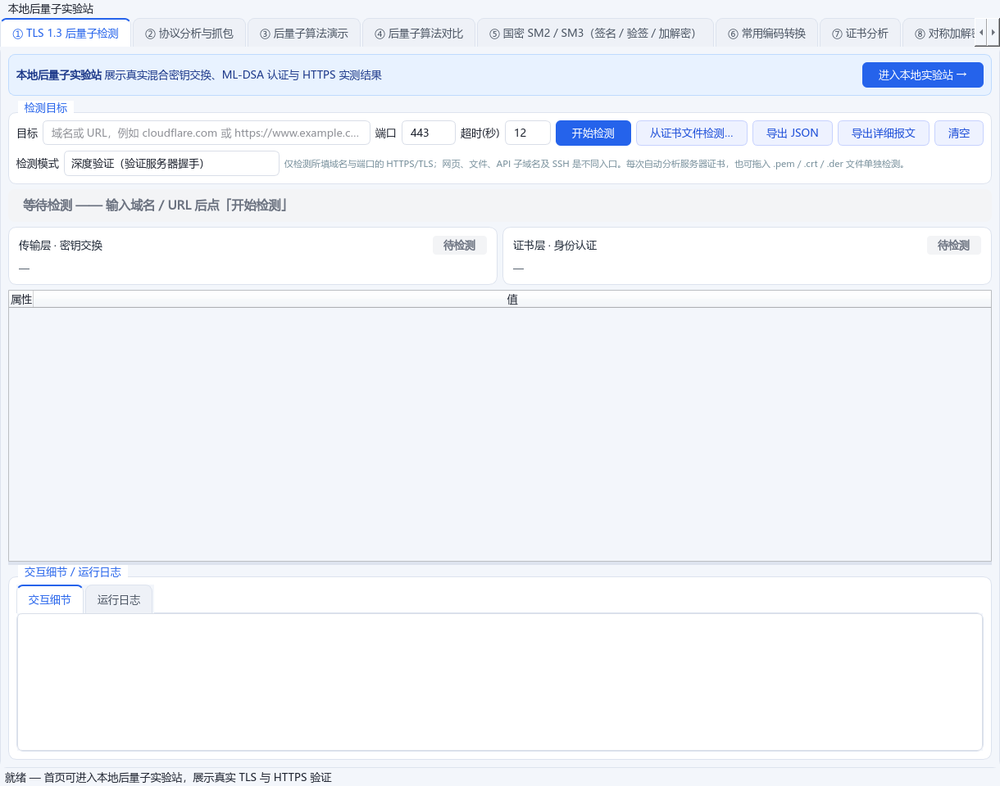
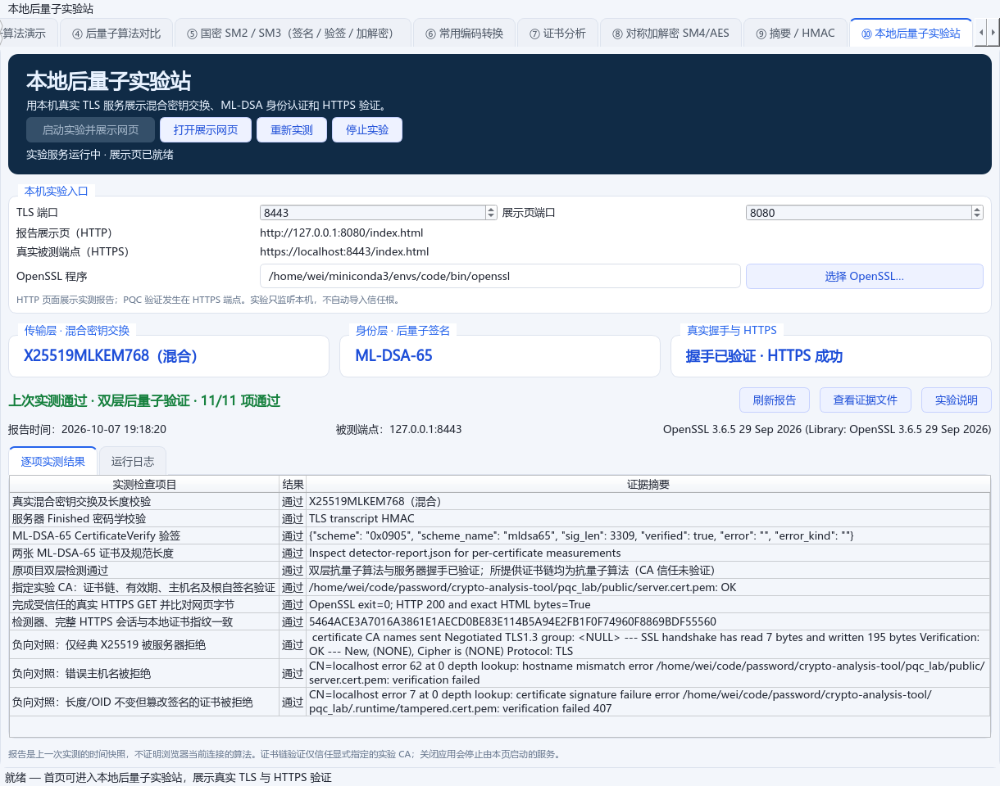

# 本地后量子实验站：页面入口与展示

实验站现已接入桌面主界面，不再需要先寻找独立脚本。首页顶部提供「进入本地实验站 →」按钮；顶部菜单「本地后量子实验站」和「② 本地后量子实验站」页签也可进入。实验站位于第二个页签，其余原有页签按相对顺序后移。[主界面](../main.py)、[入口及界面回归测试](../tests/test_pqc_lab_ui.py)

## 如何展示

1. 在项目根目录激活 `code` 环境，运行 `python main.py`。
2. 在首页顶部点击「进入本地实验站 →」。
3. 选择「实验协议」及算法：HTTPS / TLS 握手使用可选混合交换组和 ML-DSA；TCP/UDP 使用消息签名，可启用经典算法参与的混合签名。
4. 点击「启动实验并展示网页」。页面启动所选模式的真实服务、自动实测，并打开报告页。
5. 在桌面展示页查看双层算法、验证结果与逐项证据；需要再次验证时点击「重新实测」。
6. 展示结束点击「停止实验」。关闭应用也会停止由本页启动的服务；其他入口启动的服务不会被自动停止。

以上行为由 [实验站界面](../modules/pqc_lab_ui.py) 调用 [现有实验脚本](../pqc_lab/lab.py) 实现，真实启动、打开、重测、停止及关闭流程已由 [界面集成测试](../tests/test_pqc_lab_ui.py) 验证。

```bash
conda activate code
python main.py
```

默认展示页是 `http://127.0.0.1:8080/index.html`，真实被测端点是 `https://localhost:8443/index.html`。两个端口可以在启动前修改；页面显示的访问地址随实际运行记录变化。[实验站界面](../modules/pqc_lab_ui.py)

## 页面内容

| 区域 | 显示内容 |
| --- | --- |
| 顶部操作 | 启动实验并展示网页、打开展示网页、重新实测、停止实验和服务状态 |
| 本机实验入口 | HTTP 展示页、所选协议的真实被测端点、端口和 OpenSSL 程序 |
| 协议及签名选择 | HTTPS / TLS / TCP / UDP；3 种 TLS 混合组、3 种 TLS ML-DSA 签名、17 种消息签名及 5 种经典混合签名 |
| 实测算法卡片 | 实际协议及密钥交换、签名算法、握手 / HTTPS 或消息验签结果；明确提示消息明文传输 |
| 实测摘要 | 上次实测结果、通过项目数、报告时间、被测端点和 OpenSSL 版本 |
| 逐项结果 | TLS/HTTPS 的握手、证书链及负向对照；TCP/UDP 的消息验签、篡改、重放、跨协议及混合签名组成部分检查 |
| 证据与说明 | 运行日志、公开证据目录、实验搭建说明 |

显示来自真实 `pqc_lab/public/evidence.json`；缺失或不一致的报告不会显示成功。没有报告时显示等待实测。[界面报告读取](../modules/pqc_lab_ui.py)、[报告边界测试](../tests/test_pqc_lab_ui.py)

## 页面截图

当前多协议界面与真实证据见 [最新四种模式截图](2026-10-07-pqc-multilayer-validation.md#实际页面与证据)。以下截图保留首次接入时的实测画面；当前实验站已调整到第二个页签，编号为「②」。

首页的明显入口：



实验站页面，来自默认端口上的真实运行：



截图对应 **2026-10-07 19:18:20 +08:00** 的实测，目标 `127.0.0.1:8443`，11 项检查全部通过，临时服务随后已停止。截图中的成功状态属于该次运行；本机 `pqc_lab/public` 会被后续实测更新。当前四种模式的证据快照见 [最新验证记录](2026-10-07-pqc-multilayer-validation.md)。

## 首次界面接入的验证结果

- 完整测试：**270 passed，0 failed，0 skipped，29.78 秒**。[原始测试输出](pqc-lab-ui-pytest-2026-10-07.txt)
- 新增界面测试：13 项通过，覆盖明显入口、报告一致性、真实服务流程、失效运行记录、报告删除，以及外部服务抢先启动的竞态。[界面测试](../tests/test_pqc_lab_ui.py)
- 独立只读复核：上述运行记录、报告刷新和关闭所有权问题均已修复，相关 13 项测试通过。
- Python 编译检查通过；真实展示结束后没有遗留本次实验服务。

服务启动、实测和停止使用 Qt 的异步进程管理，GUI 不等待同步网络验证。自动关闭仅向运行记录 PID 与当前启动进程一致的服务发送停止请求。实验 CA 不会导入系统信任库。[界面实现](../modules/pqc_lab_ui.py)、[实验服务锁与管理](../pqc_lab/lab.py)、[Qt QProcess (2026/10 查阅)](https://doc.qt.io/qtforpython-6/PySide6/QtCore/QProcess.html)

## 外部资料

[Qt QProcess, 2026/10 查阅] The Qt Company. “PySide6.QtCore.QProcess.” Qt for Python. https://doc.qt.io/qtforpython-6/PySide6/QtCore/QProcess.html

## 多协议与数字签名扩展

本次扩展的实现、真实测试和截图见 [多协议验证记录](2026-10-07-pqc-multilayer-validation.md)。切换配置后清除旧成功状态；重测使用管理服务实际运行的协议、算法与端口。TCP/UDP 签名消息的成功结果仅表示实际消息与签名验证通过，不包含 TLS 或内容加密。[配置与报告验证](../pqc_lab/profiles.py)、[签名消息](../pqc_lab/signed_messages.py)
