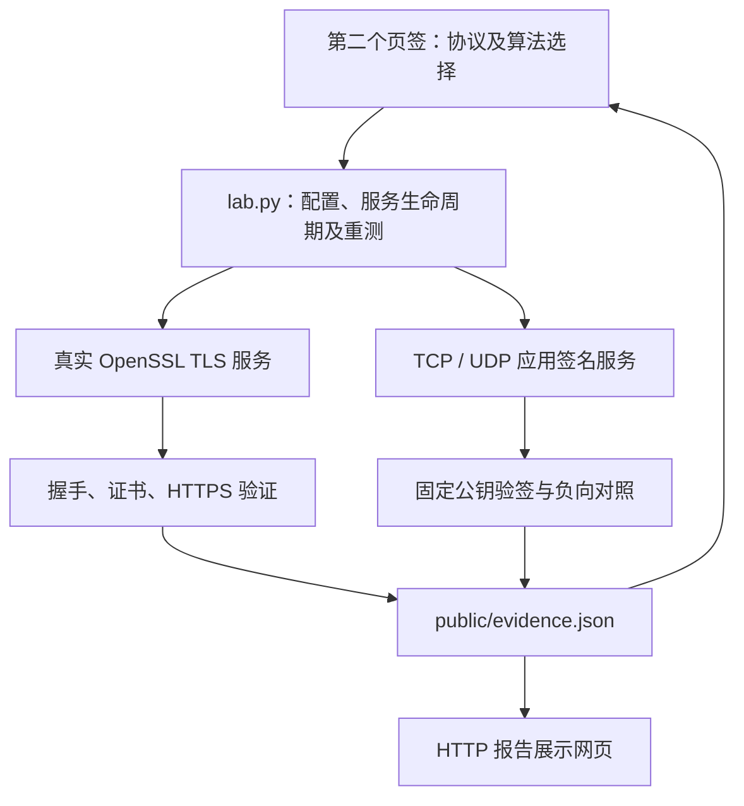
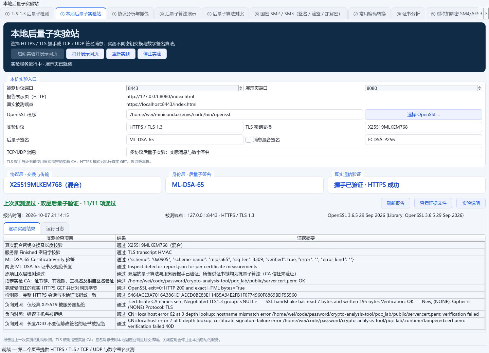
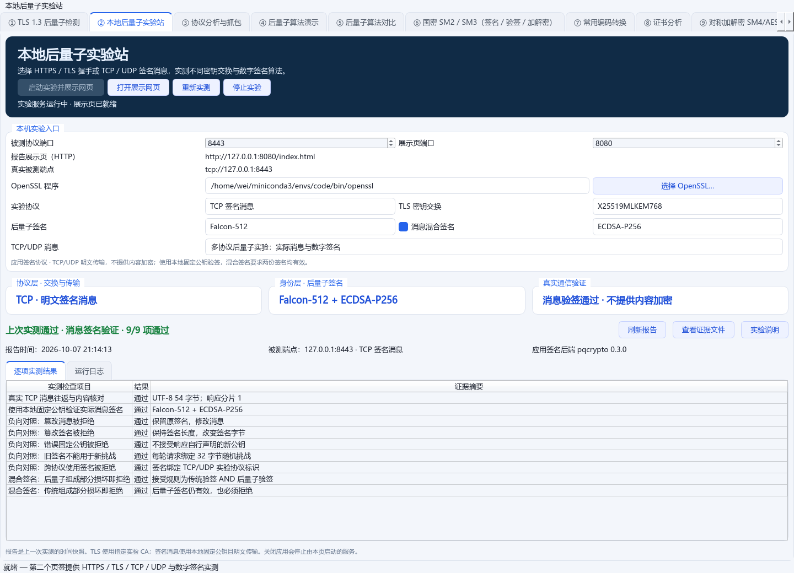
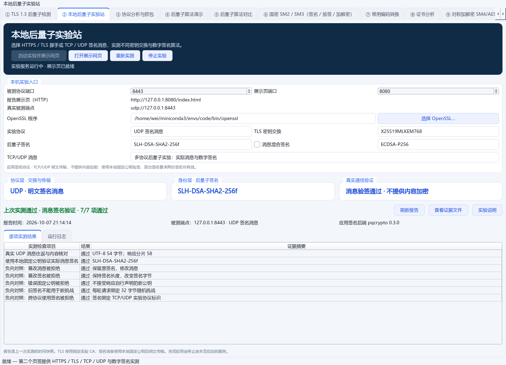

# 本地后量子实验站：多协议与数字签名验收

按用户选择的「TLS/HTTPS＋TCP/UDP 应用消息实验」扩展，入口仍是主界面的 **② 本地后量子实验站**。同一页面现在可以选择协议、TLS 交换组、后量子签名、经典混合签名及实际消息，然后启动、重测、展示和停止。[桌面界面](../modules/pqc_lab_ui.py)、[配置注册表](../pqc_lab/profiles.py)

## 做了哪些

| 实验模式 | 算法选择 | 页面展示的真实结果 |
| --- | --- | --- |
| HTTPS | 3 种混合交换组 × ML-DSA-44/65/87 | 服务器握手、证书链、CertificateVerify、Finished，以及完整 HTTPS GET 和页面内容核对 |
| TLS 1.3 握手 | 同上 | 完整 TLS 会话及身份验证，报告明确标识 TLS，不把握手成功写成 HTTPS 请求成功 |
| TCP 签名消息 | 17 种后量子签名；可加 5 种经典签名 | 实际消息往返、固定公钥验签和篡改、错误公钥、挑战重放、跨协议负向对照 |
| UDP 签名消息 | 同 TCP | 真实 UDP 传输；大签名应用分片、完整重组后验签，展示实际分片数 |

TLS 交换组为 `X25519MLKEM768`、`SecP256r1MLKEM768`、`SecP384r1MLKEM1024`。17 种消息签名包括 3 种 ML-DSA、12 种 SLH-DSA 和 Falcon-512/1024；经典组成部分可选 Ed25519、ECDSA-P256/P384、RSA-PSS-2048/3072。混合模式要求两份签名都有效。[算法及配置来源](../pqc_lab/profiles.py)、[实际组合测试](../tests/test_pqc_lab_multilayer.py)

## 怎么实现



TLS 沿用原检测器和 OpenSSL 两条验证路径，并把交换组、签名参数传入实际服务。三种 ML-DSA 身份分别保存，保留原有默认 ML-DSA-65 证书与私钥。[TLS 验证入口](../pqc_lab/lab.py)、[指定组的原检测器](../modules/pqc_detect.py)

TCP/UDP 使用已有 pqcrypto 与 cryptography 执行真实签名和验签。签名绑定协议标识、32 字节随机挑战、消息和身份；客户端从本地固定公钥文件取得预期身份，不接受响应自行提供的新公钥。TCP 使用长度帧；UDP 响应携带挑战、分片编号和总数，重组完成后再校验。[消息后端](../pqc_lab/signed_messages.py)

桌面、CLI、运行记录和报告共用配置结构。运行中锁定选择，重测读取实际服务的协议、端口和 OpenSSL；初次打开恢复保存报告的模式，随后更改配置会清除旧成功状态。浏览器按实际报告显示协议与信任范围，消息模式提供公钥、签名消息证据链接。[界面](../modules/pqc_lab_ui.py)、[报告网页](../pqc_lab/public/index.html)

## 实际页面与证据

以下是 `code` 环境在默认端口上顺序启动、验证、停止四种模式的真实 Qt 页面截图。截图保存期间没有运行独立浏览器；HTTP 报告页已通过实际 GET 获取，网页渲染另由 JavaScript 回归验证。[展示汇总](evidence/pqc-multilayer-display-2026-10-07.json)

| 场景 | 本地时间（2026-10-07，+08:00） | 结果 | 证据 |
| --- | --- | --- | --- |
| TLS：SecP256r1MLKEM768 + ML-DSA-44 | 21:14:12 | 11/11 通过 | [报告](evidence/pqc-multilayer-tls-2026-10-07.json)、[截图](screenshots/pqc-lab-multilayer-tls.png) |
| TCP：Falcon-512 + ECDSA-P256 | 21:14:13 | 9/9 通过 | [报告](evidence/pqc-multilayer-tcp-2026-10-07.json)、[截图](screenshots/pqc-lab-multilayer-tcp.png) |
| UDP：SLH-DSA-SHA2-256f | 21:14:14 | 7/7 通过；49,856 字节签名、58 个响应分片 | [报告](evidence/pqc-multilayer-udp-2026-10-07.json)、[截图](screenshots/pqc-lab-multilayer-udp.png) |
| HTTPS：X25519MLKEM768 + ML-DSA-65 | 21:14:15 | 11/11 通过 | [报告](evidence/pqc-multilayer-https-2026-10-07.json)、[截图](screenshots/pqc-lab-multilayer-https.png) |

第二个页签及协议、签名选择：



混合签名逐项验签及两种组成部分的负向对照：



UDP 大签名分片和实际验签：



以上成功仅代表对应时间的运行。展示结束后四种服务均已停止，8443 与 8080 没有遗留监听。本机最新报告保留默认 HTTPS 场景；重新启动将写入新报告。

## 验证范围与修复

真实集成覆盖 9 种 TLS 交换组与签名组合、17 种签名分别在 TCP/UDP 上传输的 34 个组合，以及 5 种经典混合签名。另覆盖 GUI 启动、重测、停止、外部服务所有权和保存报告恢复；网页测试执行实际 JavaScript，合成报告仅用于显示边界，真实握手证据来自上述网络实测。[后端测试](../tests/test_pqc_lab_multilayer.py)、[桌面测试](../tests/test_pqc_lab_ui.py)、[网页测试](../tests/test_pqc_lab_page.py)

独立复核发现并修复三个问题，均先用测试复现失败：4096 字节消息在 JSON 最坏转义下的请求上限及 UDP 接收大小、外部服务重测所用 OpenSSL、重复 UDP 分片延长等待。另补齐前置验证失败覆盖旧成功报告、首次打开恢复保存模式，以及实际展示发现的同一 TLS 端口立即重启问题。POSIX 使用 SO_REUSEADDR 处理 TIME_WAIT；运行中的监听器仍拒绝重复绑定，Windows 的独占选项保持原样。[边界回归](../tests/test_pqc_lab_multilayer.py)、[界面回归](../tests/test_pqc_lab_ui.py)、[TLS 入口](../pqc_lab/tls_frontend.py)

最终完整回归 **351 passed、0 failed、0 skipped，69.14 秒**，在 Conda `code`、Python 3.10、OpenSSL 3.6.5 下完成。[原始输出](pqc-multilayer-pytest-2026-10-07.txt)

独立复核的后端、桌面和网页专项测试 98 项通过；最后端口重启修复另经两项独立测试通过，未发现剩余阻塞问题。修改的 Python 文件编译检查通过。

```bash
conda activate code
python -m pytest -q
```

## 实验边界与使用

TCP/UDP 是本机自定义应用签名协议，**明文传输，不提供内容加密**，不包含 TLS 或 CA 信任验证。消息最多 4096 UTF-8 字节，UDP 分片最多 1200 字节、总响应最多 128 KiB，收包有绝对期限。消息私钥只在服务进程内存；TLS 私钥保存在公开目录之外。服务仅监听 127.0.0.1。[边界实现](../pqc_lab/signed_messages.py)、[TLS 身份管理](../pqc_lab/lab.py)

运行 `conda activate code`、`python main.py`，进入第二个页签，先选协议及算法，再点「启动实验并展示网页」。切换模式前点击「停止实验」。展示网页默认为 `http://127.0.0.1:8080/index.html`，真实端点随模式显示为 HTTPS/TLS 或 TCP/UDP；HTTP 报告页访问成功只证明报告页可用。[完整操作与 CLI 参数](../pqc_lab/README.md)
