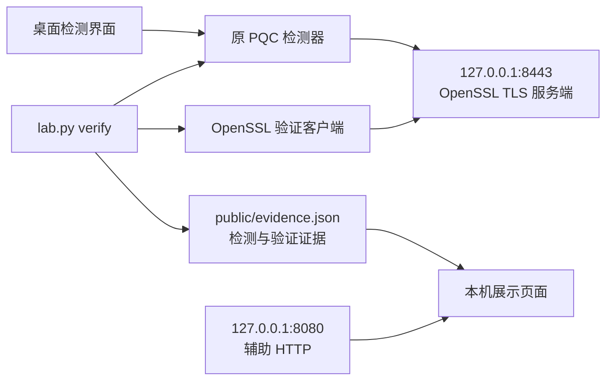

# 本地后量子实验站：多协议与数字签名

实验站支持 HTTPS、TLS 1.3 握手、TCP 签名消息和 UDP 签名消息。下面的原有双层 TLS 说明描述默认 HTTPS 场景：密钥交换限定为 `X25519MLKEM768`，根 CA 和服务器证书使用真实生成的 `ML-DSA-65` 密钥，服务器在 TLS 握手中使用该私钥生成 `CertificateVerify`。实验通过原检测器和 OpenSSL 两条验证路径生成证据，不在页面中预置成功结论。实现入口见 [实验脚本](lab.py)，验收约定见 [集成测试](../tests/test_pqc_lab.py)。

本机四种协议的实测与证据快照见 [多协议验证记录](../docs/2026-10-07-pqc-multilayer-validation.md)。已合并的原始导入副本及原作者环境的旧实测说明按用户要求删除。证书、密钥和 `public/evidence.json` 在本机初始化及验证时生成；重新运行后的最新状态以本次 `public/evidence.json` 为准。同一实验目录只允许一个服务管理进程，重复启动会被拒绝；停止后可以正常重启。

**实际被测入口是 [HTTPS 8443](https://localhost:8443/index.html)。[HTTP 8080](http://127.0.0.1:8080/index.html) 是本机辅助展示页；用 HTTP 打开它，不代表浏览器建立了抗量子连接。** 默认仅监听 `127.0.0.1`，实验脚本不会导入 Windows 或浏览器信任根。[实验脚本（2026/10），服务与验证入口](lab.py)

## 多协议实验与算法选择

桌面第二个页签提供「实验协议」「TLS 密钥交换」「后量子签名」「消息混合签名」及消息输入。停止当前实验后可以切换模式；运行中使用实际服务配置进行重测。[配置注册表](profiles.py)、[桌面实现](../modules/pqc_lab_ui.py)

| 模式 | 可选算法 | 实际验证 |
| --- | --- | --- |
| HTTPS / TLS 1.3 | X25519MLKEM768、SecP256r1MLKEM768、SecP384r1MLKEM1024；ML-DSA-44/65/87 | 真实握手、指定 CA 的证书验证；HTTPS 另执行 GET，TLS 握手模式不请求网页 |
| TCP / UDP 签名消息 | ML-DSA-44/65/87、12 种 SLH-DSA（SHA2/SHAKE × 128/192/256 × s/f）、Falcon-512/1024 | 真实网络传输、固定公钥验签、消息与签名篡改、挑战重放及跨协议负向对照 |
| TCP / UDP 混合签名 | 任一后量子消息签名，加 Ed25519、ECDSA-P256/P384 或 RSA-PSS-2048/3072 | 两种签名均有效才通过；分别损坏任一组成部分都会拒绝 |

TCP/UDP 是本机自定义的应用签名协议，**消息明文传输，不提供内容加密**。签名绑定协议、随机挑战、消息及固定公钥身份；私钥仅存在服务进程内存。消息最多 4096 UTF-8 字节；UDP 大签名使用应用分片，每片最多 1200 字节，总重组上限 128 KiB。[签名消息后端](signed_messages.py)

TLS 的三种签名身份分别保存，切换参数不会覆盖已有默认 ML-DSA-65 证书。网页证据链接指向本次算法的证书；消息模式下载固定公钥和真实签名消息，不显示 TLS 文件为该模式的证据。[身份与服务管理](lab.py)、[报告网页](public/index.html)

在项目根目录运行：

```bash
# 可选 TLS 参数的真实 HTTPS
python pqc_lab/lab.py serve --protocol https --group SecP384r1MLKEM1024 --signature ML-DSA-87

# 独立 TLS 1.3 握手场景
python pqc_lab/lab.py serve --protocol tls --signature ML-DSA-44

# TCP 后量子签名消息
python pqc_lab/lab.py serve --protocol tcp --signature Falcon-512 --message "你好，后量子实验"

# UDP 混合签名消息
python pqc_lab/lab.py serve --protocol udp --signature ML-DSA-65 --classical-signature Ed25519

# 重测和停止；重测自动读取当前管理服务的协议、端口及算法
python pqc_lab/lab.py verify
python pqc_lab/lab.py stop
```

每次只运行一个 serve 命令；不同场景需要先停止，或用独立 --base 与端口。TLS 模式需要支持所选参数的 OpenSSL；消息模式使用项目已有 pqcrypto / cryptography，不要求 OpenSSL 支持该消息签名。[CLI 与能力检查](lab.py)

## 1. 与现有项目的关系

原项目是 Python + PySide6 桌面应用。`main.py` 提供图形界面，`modules/` 提供检测、证书解析、抓包分析和算法演示逻辑；实验站作为独立目录提供服务端及验证脚本，可以与桌面程序分别启动。[项目说明（2026/10），功能与目录结构](../README.md)、[主程序（2026/10），PQC 页签与后台检测线程](../main.py)

| 组成 | 在本次实验中的职责 |
| --- | --- |
| `main.py` | 接收检测目标、调用检测模块、展示分层结论与报文信息。 |
| `modules/pqc_detect.py` | 主动构造 TLS ClientHello，读取实际协商组；深度模式派生握手密钥、解密服务器握手消息并检查 `Finished` 与 `CertificateVerify`。 |
| `modules/cert_analysis.py` | 提供证书分析功能，便于单独查看实验站导出的公开证书。 |
| `modules/pqc_demo.py` | 提供混合加密及数字签名的离线算法演示，不承担本实验的网络 TLS 服务端。 |
| `pqc_lab/lab.py` | 管理实验身份和服务进程，调用真实 OpenSSL 与原检测器，写入可复核证据。 |
| `pqc_lab/public/` | 承载页面、公开证书和本次验证产生的公开证据。 |

表中项目职责依据 [PQC 检测实现（2026/10），`detect` / `deep_verify`](../modules/pqc_detect.py)、[证书分析实现（2026/10）](../modules/cert_analysis.py)、[算法演示实现（2026/10）](../modules/pqc_demo.py) 和 [实验脚本（2026/10）](lab.py)。



原检测器深度模式验证的是服务器侧握手：它不发送客户端 `Finished`，因此不能据此断言已经完成一次 HTTPS GET。实验脚本另用 OpenSSL 完成客户端握手、证书信任校验及实际 HTTP 请求。两条路径各有明确用途。[PQC 检测实现（2026/10），`deep_verify`](../modules/pqc_detect.py)、[实验脚本（2026/10），验证流程](lab.py)

## 2. 双层抗量子具体指什么

本实验将需要验证的内容拆成以下几项；这些是配置目标，运行后的结果以证据文件为准。[实验脚本（2026/10），服务器参数与验证检查](lab.py)

| 项目 | 本实验配置 | 应检查的证据 |
| --- | --- | --- |
| 协议版本 | TLS 1.3 | 实际握手协商的版本。 |
| 密钥交换 | `X25519MLKEM768` | ServerHello 的实际协商组，以及深度模式的共享密钥派生和服务器 Finished 校验。 |
| 叶子证书公钥 | `ML-DSA-65` | 从真实证书解析出的公钥算法与长度，以及对应握手签名的验签。 |
| 叶子证书签名 | 实验根 CA 的 `ML-DSA-65` 签名 | OpenSSL 对叶子证书签名和证书链的严格校验。 |
| 根 CA | `ML-DSA-65` 自签名根 | 显式信任该根，并额外校验根自签名。 |
| 握手签名 | `mldsa65` | 当前 TLS 握手的 `CertificateVerify` 真正通过验签。 |
| 流量加密 | `TLS_AES_256_GCM_SHA384` | 实际协商的套件及成功返回的 HTTPS 内容。 |

OpenSSL 3.5 原生支持目标混合密钥交换组，默认 provider 提供 ML-DSA-65。`-groups` 和 `-sigalgs` 分别约束密钥交换和签名协商。[OpenSSL TLS 配置（2026/10，查阅），`-groups` / `-sigalgs` / HISTORY](https://docs.openssl.org/3.5/man3/SSL_CONF_cmd/)、[OpenSSL ML-DSA（2026/10，查阅），DESCRIPTION](https://docs.openssl.org/3.5/man7/EVP_PKEY-ML-DSA/)

`ML-KEM` 是密钥封装算法，`ML-DSA` 是数字签名算法；二者承担不同任务。AES-GCM 则保护协商完成后的记录内容。TLS 1.3 的套件名称独立于密钥交换与认证算法，因此只看到 `TLS_AES_256_GCM_SHA384` 并不能证明使用了抗量子密钥交换或签名。[NIST FIPS 203（2024/08），Abstract](https://csrc.nist.gov/pubs/fips/203/final)、[NIST FIPS 204（2024/08），Abstract](https://csrc.nist.gov/pubs/fips/204/final)、[RFC 8446（2018/08），§1.2](https://www.rfc-editor.org/rfc/rfc8446.html#section-1.2)

证书中的算法 OID、声明名称和长度只能作为结构证据。证书签名用于校验证书内容，`CertificateVerify` 用于证明服务器掌握对应私钥并把认证绑定到当前握手，`Finished` 校验握手转录的完整性。实验要求这些密码学检查也成功，不能把名称或尺寸匹配直接当作验签成功。[RFC 8446（2018/08），§4.4.2–4.4.4](https://www.rfc-editor.org/rfc/rfc8446.html#section-4.4.2)、[实验验证约定（2026/10）](../tests/test_pqc_lab.py)

## 3. 搭建逻辑与文件边界

`init` 使用 OpenSSL 生成独立的根 CA 密钥和服务器密钥，并由根 CA 签发服务器证书。根证书有效期为 365 天，叶子证书为 30 天；叶子证书的 Subject Alternative Name 包括 `localhost` 和 `127.0.0.1`。重复初始化保留已有的完整身份，并重新校验证书与私钥是否配套；发现只剩部分身份文件时报告不完整，避免悄悄换掉根或服务器身份。已有证书到期也不会被自动换新，应按新的独立实验身份处理。[实验脚本（2026/10），初始化流程](lab.py)、[集成测试（2026/10），身份持久化检查](../tests/test_pqc_lab.py)

```text
pqc_lab/
├── lab.py                     实验管理与验证入口
├── start.bat                  serve（内部先执行初始化）
├── verify.bat                 verify
├── stop.bat                   stop
├── README.md                  本说明
├── public/                    两个服务允许发布的内容
│   ├── index.html             展示页面
│   ├── root.cert.pem          实验根 CA 公共证书
│   ├── server.cert.pem        服务器公共证书
│   ├── evidence.json          实际运行生成的验证结果
│   ├── detector-report.json   原检测器结构化报告
│   ├── handshake.txt          原检测器详细握手记录
│   ├── openssl-chain.txt      严格证书链验证输出
│   ├── openssl-session.txt    完整 HTTPS 会话输出
│   └── negative-*.txt         负向验证输出
└── .runtime/                  本机运行状态
    └── private/               根和服务器私钥，不对外发布
```

上述目录分工由 [实验脚本（2026/10）](lab.py) 实现。`public/` 是服务根目录，私钥应始终留在 `.runtime/private/`；不要把私钥、密钥日志或包含秘密的调试材料手动复制到 `public/`。

真实 TLS 服务由 OpenSSL `s_server` 提供，实验页面由其 `-WWW` 模式返回。8443 前增加仅转发 TCP 字节的并发入口：每个实际开始握手的连接由独立 OpenSSL 子进程服务，密码运算、证书和 TLS 参数保持原样。浏览器预连接或完成 TLS 后未发送 HTTP 的连接不会阻塞另一个检测连接。最多 8 个活动 OpenSSL 子进程、32 个待处理连接；首批数据等待 3 秒，转发空闲上限 10 秒、单连接总时限 30 秒，停止服务会清理全部子进程。详见 [并发入口实现](tls_frontend.py) 和 [真实连接回归测试](../tests/test_pqc_lab_concurrency.py)。

`-WWW` 模式相对于工作目录读取文件，不提供通用 Web 应用路由：访问时须使用 `/index.html`；HTML 以外文件默认按 `text/plain` 返回。页面因此使用内嵌样式和脚本。[OpenSSL s_server（2026/10，查阅），`-WWW` / `-HTTP`](https://docs.openssl.org/3.5/man1/openssl-s_server/)、[OpenSSL 3.5.7 源码（2026/10，查阅），`www_body`](https://raw.githubusercontent.com/openssl/openssl/openssl-3.5.7/apps/s_server.c)

误把普通 HTTP 请求发到 8443 时，并发入口只返回 `307` 跳转到正确的 HTTPS 地址，不将这次明文请求视为抗量子连接。正常查看入口仍为 `https://localhost:8443/index.html`；无需浏览器证书信任的报告入口为 `http://127.0.0.1:8080/index.html`。

默认配置只允许一种混合组和一种 ML-DSA 签名方案。这是为了让本实验的协商结果明确，并让仅支持经典组的客户端成为可检查的负向样本。该策略和端口用途属于实验设计，不代表通用公网服务的兼容性配置。[实验脚本（2026/10），`server_command`](lab.py)

## 4. 启动、检测与停止

桌面界面提供明显入口：在 TLS 检测首页点击「进入本地实验站 →」，或使用顶部「本地后量子实验站」菜单，进入「② 本地后量子实验站」页签。先选择协议和算法，点击「启动实验并展示网页」后，界面启动真实服务、自动实测并打开展示页；也支持重新实测和停止。关闭应用会停止本页启动的服务，其他入口启动的服务保留。截图与操作见 [实验站页面说明](../docs/2026-10-07-pqc-lab-ui.md)。

Linux Conda `code` 环境的真实测试已完成：OpenSSL 3.6.5，多协议扩展后主项目完整测试 351 项通过、无跳过。先 `conda activate code` 可自动选择该环境的 OpenSSL；安装记录见 [code 环境补测记录](../docs/2026-10-07-code-pqc-validation.md)，最新实测与截图见 [多协议验证记录](../docs/2026-10-07-pqc-multilayer-validation.md)。

以下命令在项目根目录执行。命令接口以 [实验脚本（2026/10），命令行入口](lab.py) 为准；先查看帮助也可核对当前版本的可选参数。

```powershell
python pqc_lab/lab.py --help
python pqc_lab/lab.py init
python pqc_lab/lab.py serve
```

`serve` 内部会先执行初始化检查，启动服务后自动运行一次验证；因此也可直接执行 `serve` 或双击 `start.bat`。服务持续运行时，在另一个终端执行后续 `verify` / `status` / `stop` 命令。[实验脚本（2026/10），`serve`](lab.py)

若自动查找的 OpenSSL 不正确，显式选择支持所需算法的程序。当前 Windows 环境中可采用 Git 自带的原生可执行文件；其他机器应换成自己的路径。可先用下列只读命令确认能力，不要仅根据文件名判断版本。

```powershell
& 'D:\Git\mingw64\bin\openssl.exe' version
& 'D:\Git\mingw64\bin\openssl.exe' list -tls-groups
& 'D:\Git\mingw64\bin\openssl.exe' list -tls-signature-algorithms

python pqc_lab/lab.py init --openssl 'D:\Git\mingw64\bin\openssl.exe'
python pqc_lab/lab.py serve --openssl 'D:\Git\mingw64\bin\openssl.exe'
```

算法列表中应能找到 `X25519MLKEM768` 和 `mldsa65`。版本与功能之间的依据见 [OpenSSL TLS 配置（2026/10，查阅），HISTORY](https://docs.openssl.org/3.5/man3/SSL_CONF_cmd/)；实际所用可执行文件应以命令输出和验证报告记录为准。

Windows 快捷脚本与命令行的对应关系为：

| 操作 | 快捷脚本 | 命令 |
| --- | --- | --- |
| 初始化并启动 | `pqc_lab\start.bat` | 执行 `serve`，由服务入口自动初始化并验证。 |
| 重新验证当前服务 | `pqc_lab\verify.bat` | `python pqc_lab/lab.py verify` |
| 查看运行状态 | — | `python pqc_lab/lab.py status` |
| 停止实验服务 | `pqc_lab\stop.bat` | `python pqc_lab/lab.py stop` |

接口来源：[实验脚本（2026/10）](lab.py)、[启动脚本](start.bat)、[验证脚本](verify.bat)、[停止脚本](stop.bat)。

需要独立实验目录或其他端口时，可使用 `--base`、`--port`、`--http-port`；之后验证和状态管理也应指向同一个实验目录，验证时传入实际 TLS 端口。`status` 检查运行记录和 TCP 监听状态，不替代密码学验证。[实验脚本（2026/10），命令行入口](lab.py)

启动后可以打开 [HTTP 辅助页面](http://127.0.0.1:8080/index.html) 查看运行说明和证据，也可以用兼容客户端访问 [HTTPS 实验入口](https://localhost:8443/index.html)。在原桌面工具的「抗量子密码检测」页签输入 `127.0.0.1:8443`，选择深度验证并开始检测；8080 不是该页签的 TLS 检测目标。[主程序（2026/10），PQC 页签](../main.py)、[实验脚本（2026/10）](lab.py)

显式路径验证示例：

```powershell
python pqc_lab/lab.py verify --openssl 'D:\Git\mingw64\bin\openssl.exe'
python pqc_lab/lab.py status
```

## 5. 如何判断实验是否成立

`verify` 应同时检查以下项目，并把本次结果写入公开证据。表中描述的是通过条件，**不是本文对本次运行的预先判定**。[实验脚本（2026/10），验证流程](lab.py)、[集成测试（2026/10），正负向检查](../tests/test_pqc_lab.py)

| 检查 | 通过条件 | 所回答的问题 |
| --- | --- | --- |
| 原检测器深度验证 | 实际协商目标混合组，真实 `Finished` 和 `CertificateVerify` 校验成功。 | 当前服务器握手是否真正使用并执行了目标密码算法？ |
| 严格证书链检查 | 仅信任实验根，叶子用途、证书链、主机名和根自签名均通过校验。 | 证书是否能在本实验显式指定的信任范围内成立？ |
| 完整 HTTPS GET | 验证客户端完成握手，收到实际 `/index.html` 内容。 | TLS 通道是否可承载应用数据？ |
| 仅经典组客户端 | 仅提供经典密钥交换组时握手被拒绝。 | 服务端是否错误地回退到了经典密钥交换？ |
| 错误主机名 | 对证书 SAN 以外的主机名执行验证时被拒绝。 | 主机名检查是否真的生效？ |
| 篡改证书 | 修改证书签名后的验证被拒绝。 | 证书校验是否真正检查签名？ |

OpenSSL `s_client` 默认偏向诊断用途，可能在证书验证报错后继续握手；严格测试必须启用 `-verify_return_error`。主机名校验需要 `-verify_hostname` 或对应 IP 校验选项，根自签名需要 `-check_ss_sig`。这些选项避免把「命令有输出」误写成「可信认证成功」。[OpenSSL s_client（2026/10，查阅），验证选项](https://docs.openssl.org/3.5/man1/openssl-s_client/)、[OpenSSL 证书验证（2026/10，查阅），OPTIONS](https://docs.openssl.org/3.5/man1/openssl-verification-options/)

阅读 [生成的 evidence.json](public/evidence.json) 时，应核对目标地址、时间、OpenSSL 版本、各项检查状态以及关联的原始输出；再对照 [检测器报告](public/detector-report.json)、[握手记录](public/handshake.txt)、[证书链验证输出](public/openssl-chain.txt) 和 [完整 HTTPS 会话输出](public/openssl-session.txt)。可执行文件路径由启动时的 `--openssl` 选择。新一次验证失败时，不应保留旧成功状态来代表本次运行。该要求也包含在 [集成测试（2026/10），服务停止后再次验证](../tests/test_pqc_lab.py) 中。

不要用页面颜色、静态算法名称、证书 OID 或某个固定指纹代替以上检查。本文不列固定指纹：密钥由实际初始化产生，应从当前公开证书和运行证据中读取。证据文件记录的是一次测试结果；即使上一次成功，修改服务、证书或端口后仍需重新执行 `verify`。[实验脚本（2026/10），初始化与证据生成](lab.py)

## 6. 信任和浏览器兼容性边界

本实验采用私有 CA。给 OpenSSL 指定实验根，表示该次验证明确信任此根；服务器把根证书放进证书链，并不会自动使客户端信任它。实验脚本不修改操作系统或浏览器的信任存储。[OpenSSL 证书验证（2026/10，查阅），Trusted Certificate Options](https://docs.openssl.org/3.5/man1/openssl-verification-options/)、[实验脚本（2026/10）](lab.py)

若浏览器显示 `ERR_CERT_AUTHORITY_INVALID`，可主动将本实验根加入 Windows **当前用户**的根证书库。`serve` / `verify` 不会执行此操作；单独的 [trust-root.ps1](trust-root.ps1) 先提供只读检查，再由用户决定是否导入。导入会使当前用户信任本实验 CA 签发的证书；撤销时只删除该根的精确 SHA-1 指纹，不清空信任库。

```powershell
powershell -File pqc_lab/trust-root.ps1 -Action inspect
powershell -File pqc_lab/trust-root.ps1 -Action install
# 实验结束后，如需撤销：
powershell -File pqc_lab/trust-root.ps1 -Action remove
```

原作者环境曾手动导入实验根；本次代码合并未生成或导入任何信任根。其他机器需先初始化本机身份，再决定是否运行上述安装命令。导入后刷新 HTTPS 页面；必要时重新打开浏览器加载信任状态。

不能把浏览器兼容性概括为「浏览器都不支持 ML-DSA」。Google 官方发布说明称，Chrome 150 在非 iOS 平台默认支持 ML-DSA TLS 签名与证书，但用户或管理员仍须显式配置受信任根，且当前不能签发公网受信任的 ML-DSA 证书。实际使用还应核对浏览器版本和平台。[Chrome 发布说明（2026/10，查阅），Support for ML-DSA in TLS](https://support.google.com/chrome/a/answer/10314655?hl=EN)

如果浏览器无法打开 HTTPS 入口，需要分别检查算法支持和 CA 信任：前者不足可能直接导致握手失败；后者不足会导致证书信任错误。浏览器显示未受信任不等于已经证明密码学验签失败。辅助 HTTP 页面可供查看说明，真正的连接验证以带显式 CA 校验的 OpenSSL 测试和原检测器深度证据为准。[Chrome 发布说明（2026/10，查阅），Support for ML-DSA in TLS](https://support.google.com/chrome/a/answer/10314655?hl=EN)、[OpenSSL s_client（2026/10，查阅），验证选项](https://docs.openssl.org/3.5/man1/openssl-s_client/)

本实验的结论限定于当前本机入口、当前证书和本次测试，不构成公网 CA 信任、生产部署审计或整个系统抗量子安全性的保证。这里的「双层」专指密钥交换与证书/握手身份认证两部分；完整身份验证仍依赖显式选择的信任根。[实验设计（2026/10），目标与验收](../docs/pqc-lab-plan.md)

## 7. 常见问题

| 现象 | 检查方法 |
| --- | --- |
| 提示找不到合适的 OpenSSL | 运行能力查询命令，显式传入 `--openssl`；Python `ssl` 使用的库与外部 `openssl.exe` 不一定是同一个构建。 |
| 8443 或 8080 无法绑定 | 执行 `status`，检查端口是否已由其他进程占用；先正常停止已有实验服务再重新启动。 |
| `/` 没有展示主页 | 使用完整路径 `/index.html`，不要依赖 `s_server -WWW` 的自动首页路由。 |
| 浏览器证书不受信任 | 使用 `verify` 的显式实验根验证；该错误不能通过普通 HTTP 页面消除。 |
| 检测结果只显示快速证据 | 检查握手明细及依赖错误；本实验验收要求深度验签结果，快速识别不能替代它。 |
| 页面显示旧时间 | 对运行中的服务重新执行 `verify`，再刷新页面并核对证据时间。 |
| 初始化提示身份文件不完整 | 检查 `.runtime/private/` 和公开证书是否配套，恢复原文件或在独立实验副本重新初始化；不要混用不同次生成的 CA 和服务器密钥。 |

排查依据：[实验脚本（2026/10）](lab.py)、[PQC 检测实现（2026/10），深度与快速模式](../modules/pqc_detect.py)、[集成测试（2026/10），身份完整性检查](../tests/test_pqc_lab.py)、[OpenSSL s_server（2026/10，查阅），`-WWW`](https://docs.openssl.org/3.5/man1/openssl-s_server/)。

## 8. 官方参考

外部网页查阅于 2026-10-07；标注「查阅」的日期是核对时间，不是该文档的发布日期。以下参考解释算法、协议和工具行为；本仓库的运行结果应查看本次生成的证据。

[OpenSSL TLS 配置, 2026/10 查阅] OpenSSL Project. “SSL_CONF_cmd.” OpenSSL 3.5 Documentation. [官方文档](https://docs.openssl.org/3.5/man3/SSL_CONF_cmd/)

[OpenSSL ML-DSA, 2026/10 查阅] OpenSSL Project. “EVP_PKEY-ML-DSA.” OpenSSL 3.5 Documentation. [官方文档](https://docs.openssl.org/3.5/man7/EVP_PKEY-ML-DSA/)

[OpenSSL s_server, 2026/10 查阅] OpenSSL Project. “openssl-s_server.” OpenSSL 3.5 Documentation. [官方文档](https://docs.openssl.org/3.5/man1/openssl-s_server/)

[OpenSSL s_client, 2026/10 查阅] OpenSSL Project. “openssl-s_client.” OpenSSL 3.5 Documentation. [官方文档](https://docs.openssl.org/3.5/man1/openssl-s_client/)

[OpenSSL 证书验证, 2026/10 查阅] OpenSSL Project. “openssl-verification-options.” OpenSSL 3.5 Documentation. [官方文档](https://docs.openssl.org/3.5/man1/openssl-verification-options/)

[OpenSSL 证书生成, 2026/10 查阅] OpenSSL Project. “openssl-req” / “openssl-x509.” OpenSSL 3.5 Documentation. [证书请求与生成](https://docs.openssl.org/3.5/man1/openssl-req/)、[证书签发与检查](https://docs.openssl.org/3.5/man1/openssl-x509/)

[OpenSSL 3.5.7 源码, 2026/10 查阅] OpenSSL Project. “apps/s_server.c.” OpenSSL 3.5.7. [固定版本源码](https://raw.githubusercontent.com/openssl/openssl/openssl-3.5.7/apps/s_server.c)

[NIST FIPS 203, 2024/08] NIST. “Module-Lattice-Based Key-Encapsulation Mechanism Standard.” [标准主页](https://csrc.nist.gov/pubs/fips/203/final)

[NIST FIPS 204, 2024/08] NIST. “Module-Lattice-Based Digital Signature Standard.” [标准主页](https://csrc.nist.gov/pubs/fips/204/final)

[RFC 8446, 2018/08] Eric Rescorla. “The Transport Layer Security (TLS) Protocol Version 1.3.” IETF. [规范正文](https://www.rfc-editor.org/rfc/rfc8446.html)

[Chrome 发布说明, 2026/10 查阅] Google. “Previous release notes — Support for ML-DSA in TLS.” Chrome Enterprise and Education Help. [官方发布说明](https://support.google.com/chrome/a/answer/10314655?hl=EN)
